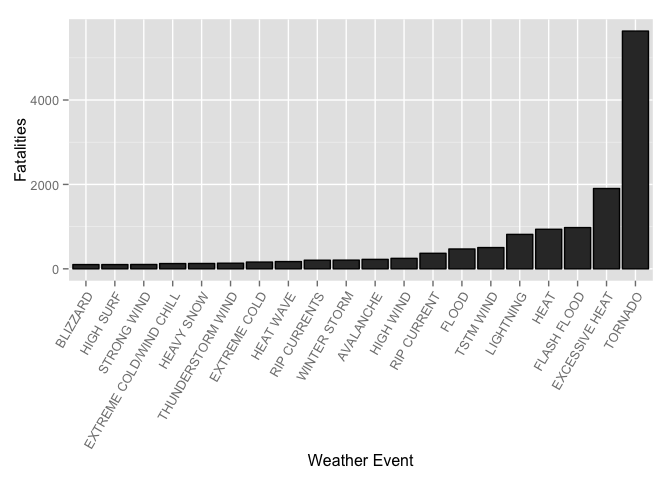
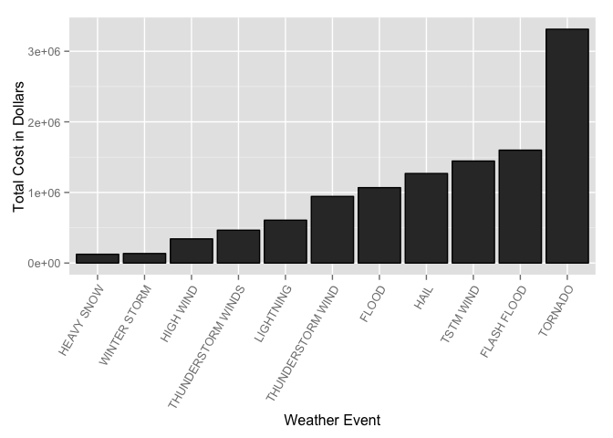

# NOAA Storm Database Analysis
Utah Ingersoll  
August 23, 2014  
## Summary

The U.S. National Oceanic and Atmospheric Administration's (NOAA) storm database
contains records of storm events from the 1950s to the present. It records many
variables including total fatalities, property damage and crop damage. We will
look at this data to learn which events are most deadly and which have the
highest economic impact.

## Data Processing

The data for this project can be found at:
https://d396qusza40orc.cloudfront.net/repdata/data/StormData.csv.bz2.

First we download and decompress the archive archive:

```r
archive.url <- 'https://d396qusza40orc.cloudfront.net/repdata/data/StormData.csv.bz2'
archive.name <- 'StormData.csv.bz2'
csv.name <- 'StormData.csv'
if(!file.exists(archive.name)) {
        download.file(archive.url, destfile=archive.name, method="curl")
        }
```

We will use the following R packages in our analysis:

```r
packages <- c("ggplot2", "dplyr")
if (length(setdiff(packages, rownames(installed.packages()))) > 0) {
  install.packages(setdiff(packages, rownames(installed.packages())))  
}
library(ggplot2)
library(dplyr)
```

Loading the data into memory can take a few minuits. Be patient.

```r
if(!exists('storm')) { storm <- read.csv(bzfile(archive.name),header=T) }
```

First we will ad a new colum to represent total economic impact by summing
property and crop damage.

```r
storm <- mutate(storm,COST = PROPDMG + CROPDMG)
```

To find the most fata events we sum fatalities for each event type.
We will only look at events which caused more than 100 fatalities.

```r
fatalities <- tapply(storm$FATALITIES,storm$EVTYPE,sum)
fatalities <- sort(fatalities,decreasing=T)
fatalities <- as.data.frame(fatalities)
fatalities <- subset(fatalities,fatalities>=100)
fatalities <- data.frame(Storm=rownames(fatalities),Fatalities=as.vector(fatalities$fatalities))
```

To determin which events types were the msot costly we sum our combined cost
for each event.
Here we will only look at events which caused more than 100000 in damage.

```r
cost <- tapply(storm$COST,storm$EVTYPE,sum)
cost <- sort(cost,decreasing=T)
cost <- as.data.frame(cost)
cost <- subset(cost,cost>=100000)
cost <- data.frame(Storm=rownames(cost),cost=as.vector(cost$cost))
```


## Results

Tornados are a creal winner for the most fatal event type:

```r
library(ggplot2)
fatalities.plot <- ggplot(data=fatalities,aes(x=reorder(Storm,Fatalities),y=Fatalities))
fatalities.plot <- fatalities.plot + geom_bar(stat="identity", colour="black")
fatalities.plot <- fatalities.plot + xlab("Weather Event")
fatalities.plot <- fatalities.plot + theme(axis.text.x = element_text(angle=60, hjust=1))
fatalities.plot
```

 

Tornados also cause the greatest economic impact.

```r
cost.plot <- ggplot(data=cost,aes(x=reorder(Storm,cost),y=cost))
cost.plot <- cost.plot + geom_bar(stat="identity", colour="black")
cost.plot <- cost.plot + xlab("Weather Event")
cost.plot <- cost.plot + ylab("Total Cost in Dollars")
cost.plot <- cost.plot + theme(axis.text.x = element_text(angle=60, hjust=1))
cost.plot
```

 
